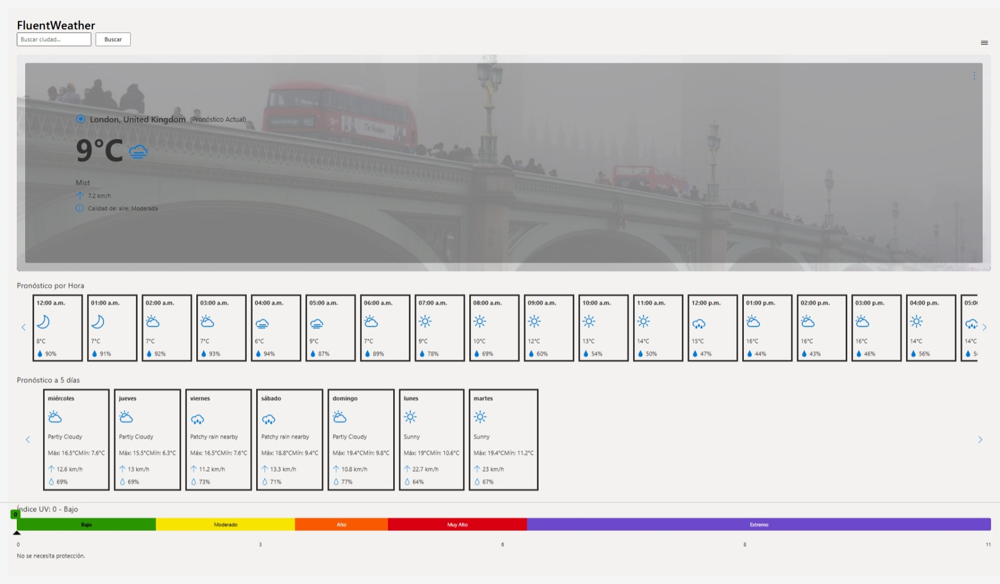
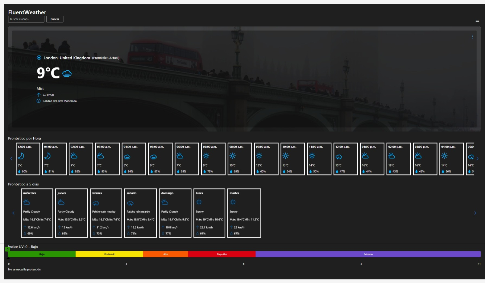

# FluentWeather

this is a website Demo that uses Fluent components to make a weather forecast website


## Main Features
 - UI based on Microsoft's fluent Design System
 - detailed weather forecast on the next 5 days
 - hourly forecast visualization
 - detalled view of any day or hour selected
 - unit conversion is supported (temperature and wind speed)
 - dynamic icons based on the forecast
 - dynamic background based on the forecast and city
 - forecast comparsion between cities
 - geolocation-based city search (use your current location instead of typing a city)
 - Dark Mode Works! 

## Tech Stack

- Frontend: React 17 + Fluent UI, bundled with [Vite](https://vitejs.dev)
- Backend: Flask ([back/background.py](back/background.py)), deployed as a Vercel Python function
- Testing: Vitest + Testing Library
- Data: [weatherapi.com](https://www.weatherapi.com) for forecasts, [Pexels](https://www.pexels.com) for background images

## Installation

```bash
git clone https://github.com/XDurango2/Fluent-Weather.git
cd Fluent-Weather
npm install
npm run dev
```

The frontend expects the API at `/api/*`. Locally that means either running against a deployed backend (see `server.proxy` in `vite.config.ts`) or deploying the whole project to Vercel, which serves both from the same domain (see `vercel.json`).

The backend (`back/background.py`) needs two environment variables, not included in the repo:
- `WEATHER_API_KEY` — from [weatherapi.com](https://www.weatherapi.com)
- `PEXELS_API_KEY` — from [pexels.com](https://www.pexels.com/api)

## Available Scripts
npm run dev – Run in development mode

npm test – Run the test suite (Vitest)

npm run build – Create a production-ready build in `dist/`

npm run preview – Serve the production build locally

PLEASE, NOTE: the backend of the project is in back/background.py

## Roadmap

- Support for multiple languages
- Weather alerts integration
- Real-time weather maps
## Powered By

Photos provided with  


Weather data provided by 

# Contributing

This project welcomes contributions and suggestions. Most contributions require you to agree to a
Contributor License Agreement (CLA) declaring that you have the right to, and actually do, grant us
the rights to use your contribution. For details, visit https://cla.microsoft.com.

When you submit a pull request, a CLA-bot will automatically determine whether you need to provide
a CLA and decorate the PR appropriately (e.g., label, comment). Simply follow the instructions
provided by the bot. You will only need to do this once across all repos using our CLA.

This project has adopted the [Microsoft Open Source Code of Conduct](https://opensource.microsoft.com/codeofconduct/).
For more information see the [Code of Conduct FAQ](https://opensource.microsoft.com/codeofconduct/faq/) or
contact [opencode@microsoft.com](mailto:opencode@microsoft.com) with any additional questions or comments.
